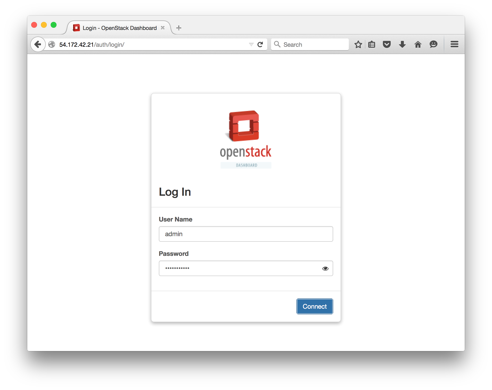
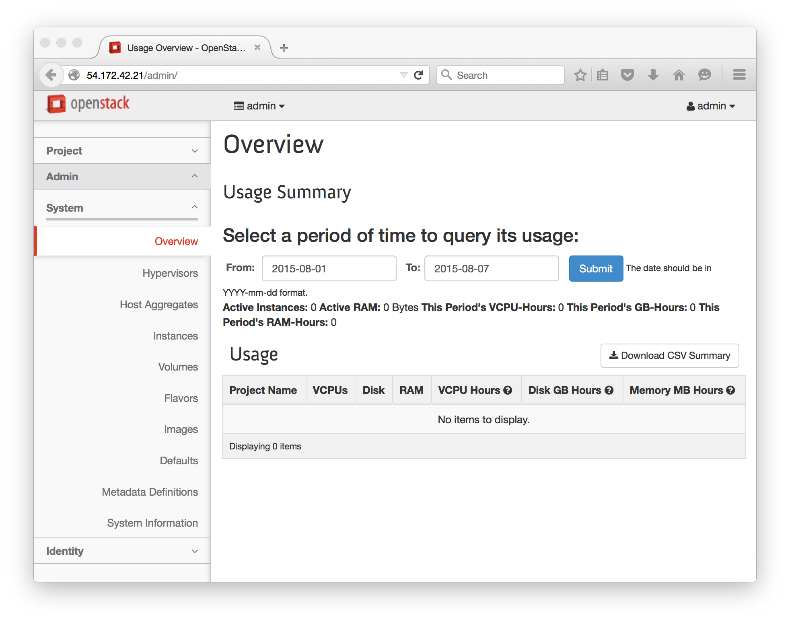

# Lab 1 - DevStack Controller

  Lab Objectives:

  0. Install a DevStack controller

## Connect to your controller instance:
  0. `chmod 400 student.pem`
  0. `ssh ubuntu@W.X.Y.Z -i student.pem`
  0. `sudo whoami` 

## Install DevStack:
  0. `sudo apt-get install git`
  0. `git clone https://git.openstack.org/openstack-dev/devstack`
  0. `cd devstack`
  0. `cp samples/local.conf local.conf`
  0.  Record your instance's internal IP address in the [Lab 0 table](../README.md) 
     
      `ip addr show dev eth0` 

  0.  Edit the 'local.conf` file.  The sample config file will have useful comments which are not replicated below.
      
      `nano local.conf` or `vim local.conf`
      
      ``` shell
        [[local|localrc]]

        # tokens and passwords
        SERVICE_TOKEN=DKS3MQMX72MSLQP231N # an alphanumeric token
        ADMIN_PASSWORD=supersecret
        MYSQL_PASSWORD=radicallyrelational
        RABBIT_PASSWORD=rasciallyrabbit
        SERVICE_PASSWORD=supersecret

        FLAT_INTERFACE=eth0

        # private IPs
        FIXED_RANGE=10.0.0.0/16
        FIXED_NETWORK_SIZE=65534

        # public IPs
        FLOATING_RANGE=192.168.0.0/24

        MULTI_HOST=True

        # $DEST is the install location (default /opt/stack)
        LOGFILE=$DEST/logs/stack.sh.log
        LOGDAYS=2

        SWIFT_HASH=66a3d6b56c1f479c8b4e70ab5c2000f5
        SWIFT_REPLICAS=1
        SWIFT_DATA_DIR=$DEST/data
        enable_service tempest
      ```

  0. Run stack.sh, this will take awhile, see [common errors](common-errors.md) if anything fails.
    
    `./stack.sh 2>&1 | tee stack.log`

    > :white_check_mark: **Additional Info**:
    >
    > * `stack.sh` is a very long, but well documented script.  Check it out [here](http://docs.openstack.org/developer/devstack/stack.sh.html).
    >
    > *  In order to capture the printed results of `stack.sh` we pipe it to a file
    >   * `2>&1` pipes stderr to stdout (allowing us to capture both)
    >   * `|` is a pipe, it sends values to the next command
    >   * `tee` is splits a pipe (like a "T) it sends printed results to a file `stack.log` in addition to printing to the screen

  0. Login to the OpenStack Horizon Web Interface by navigating your browser to the public IP address of your instance, explore the accessible pages and fill in the table of information

    
    
    

    :red_circle: TODO items from interface

    | Info to find | Value |
    | -------------| ----- |
    | Item 1 | |
    | Item 2 | |
    
    
#### [Next Lab](../lab-02)    
