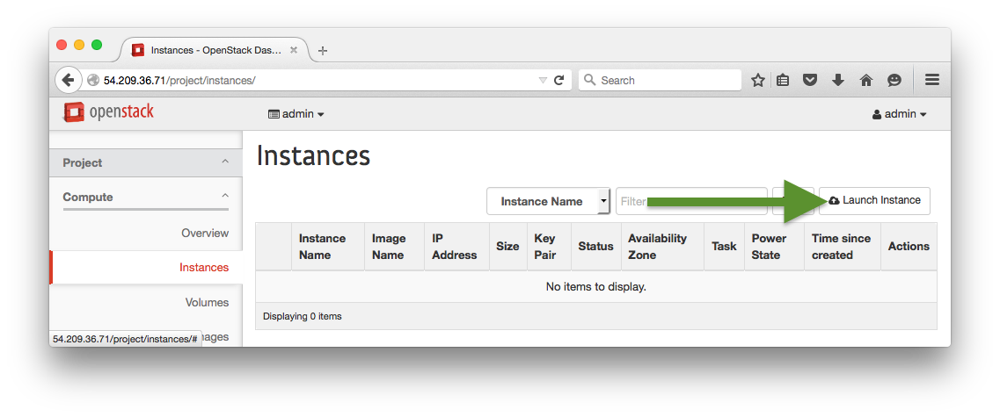
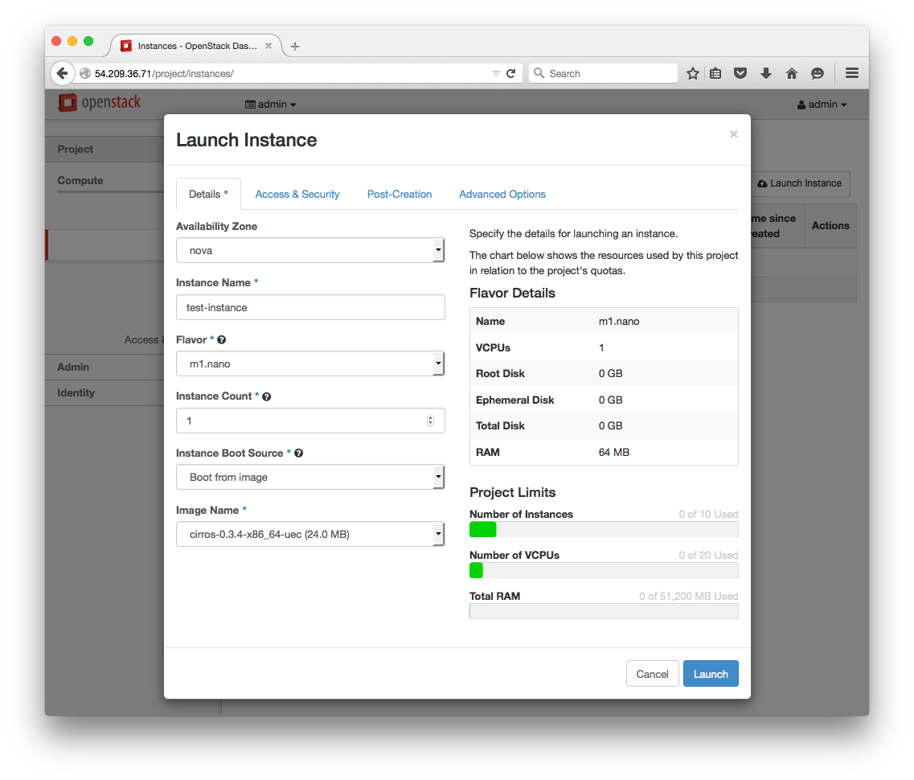
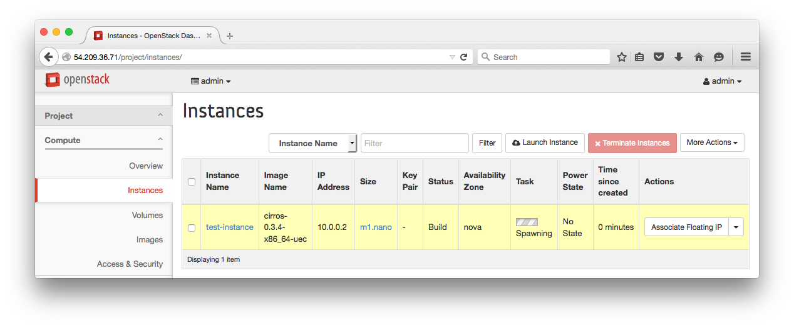
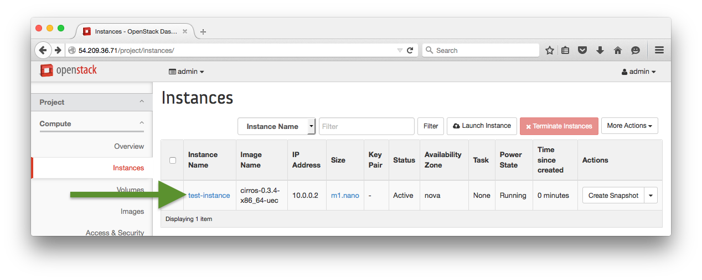

# Lab 2 - DevStack Horizon Interface

  Lab Objectives:

  0. Become familiar with the OpenStack Horizon Interface
  0. Launch an instance from the Horizon Interface

## Add a User:
  
  :red_circle: TODO, currently broken in DevStack, launching instance should change to be user logged in

## Add a Project:

  :red_circle: TODO, currently broken in DevStack

## Launch an Instance:

  0. Open the Horizon interface (navigate your browser to the public IP address)
  0. Project > Compute > Instances > Launch Instance
  
    

  0. Set details and Launch

    
    
 
  0. Open console, login and interact with the newly launched instance
    
    
    
    
    

  0. Use `ssh` to access and interact with the newly launched instance

    * Ensure you are currently ssh'ed into the controller instance
    * If not follow steps from previous lab
    * `ssh cirros@10.0.0.2` (password `cubswin:)`)

#### [Next Lab](../lab-03)    
