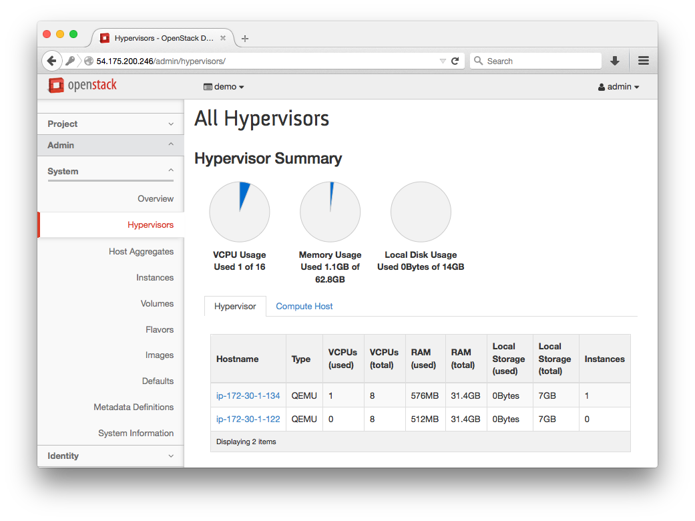
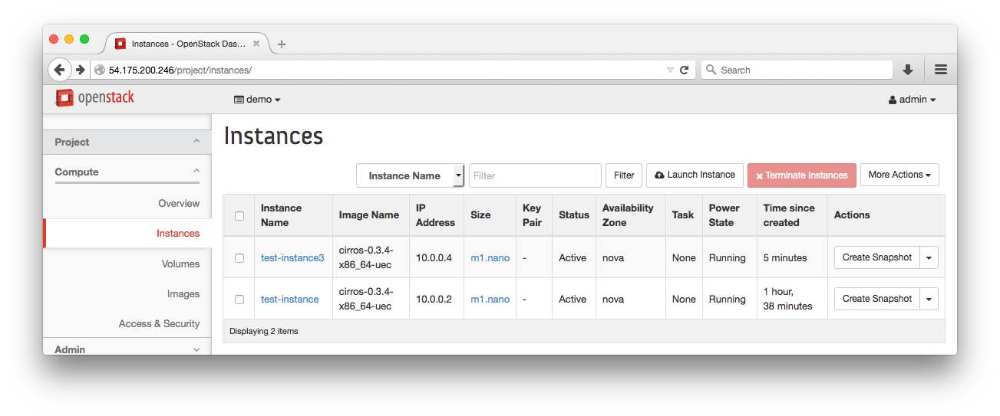
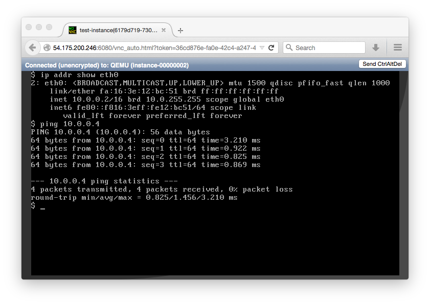

# Lab 3 - DevStack Compute

  Lab Objectives:

  0. Install and link a DevStack Compute node

## Connect to your _compute_ instance:
  0. `ssh ubuntu@<COMPUTE IP> -i student.pem`
  0. `sudo whoami` 

## Install DevStack:
  0. `sudo apt-get install git`
  0. `git clone https://git.openstack.org/openstack-dev/devstack`
  0. `cd devstack`
  0. `cp samples/local.conf local.conf`
  0.  Record your instance's internal IP address in the [Lab 0 table](../README.md) 
     
      `ip addr show dev eth0` 
     
  0.  Edit the 'local.conf` file.  The sample config file will have useful comments which are not replicated below.

    
      `nano local.conf` or `vim local.conf`

      ``` shell
        [[local|localrc]]

        HOST_IP=W.X.Y.Z # The compute node's internal IP address
        FIRST_HOST=W.X.Y.Z # The controller's internal IP address 
        FIRST_HOST_PUBLIC=A.B.C.D # The controller's public IP address 

        SERVICE_HOST=$FIRST_HOST
        MYSQL_HOST=$FIRST_HOST
        RABBIT_HOST=$FIRST_HOST
        GLANCE_HOSTPORT=$FIRST_HOST:9292

        ENABLED_SERVICES=n-cpu,n-net,n-api,c-vol

        NOVA_VNC_ENABLED=True
        NOVNCPROXY_URL="http://$FIRST_HOST_PUBLIC:6080/vnc_auto.html"
        VNCSERVER_LISTEN=$HOST_IP
        VNCSERVER_PROXYCLIENT_ADDRESS=$VNCSERVER_LISTEN

        DATABASE_TYPE=mysql

        # tokens and passwords
        SERVICE_TOKEN=DKS3MQMX72MSLQP231N # an alphanumeric token
        ADMIN_PASSWORD=supersecret
        MYSQL_PASSWORD=radicallyrelational
        RABBIT_PASSWORD=rasciallyrabbit
        SERVICE_PASSWORD=supersecret

        FLAT_INTERFACE=eth0

        # private IPs
        FIXED_RANGE=10.0.0.0/16
        FIXED_NETWORK_SIZE=65534
        # public IPs
        FLOATING_RANGE=192.168.0.0/24

        MULTI_HOST=True

        LOGFILE=$DEST/logs/stack.sh.log
        LOGDAYS=2
      ``` 
     
      * Be sure to remove config lines from the sample config about Swift and Tempest

  0. Run `ip addr show`
  0. Run stack.sh, this will take a little bit less time that Lab 1
    
     `./stack.sh 2>&1 | tee stack.log`

  0. Run `ip addr show` again and notice the added interfaces and bridges
  0. Login to the OpenStack Horizon Web Interface by navigating your browser to the public IP address of the controller
  0. Admin > System > Hypervisors and marvel at the number of Hypervisors
   
     

  0. Launch another Instance and ping between the two currently running instances 

     Project > Compute > Instances > Launch Instance
     
     
     
     
      
#### [Next Lab](../lab-04)    
