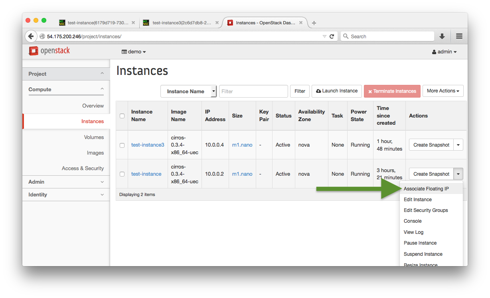
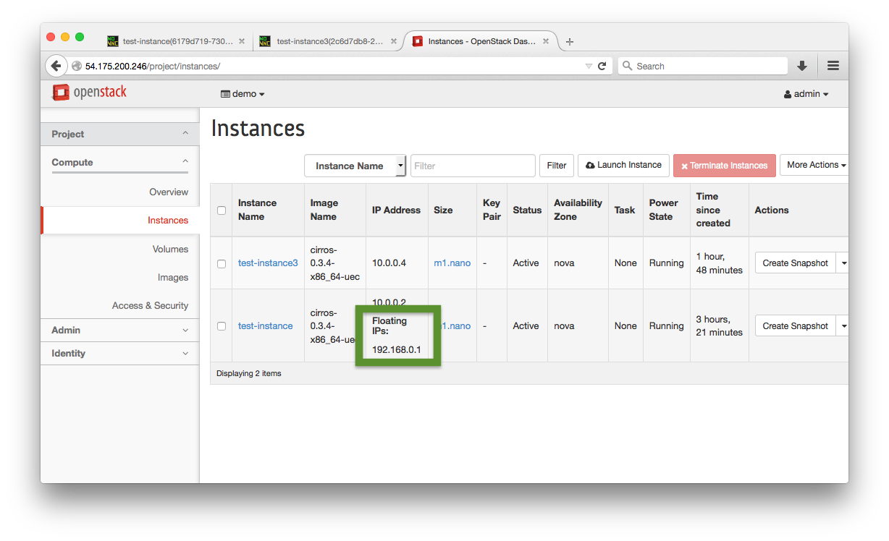
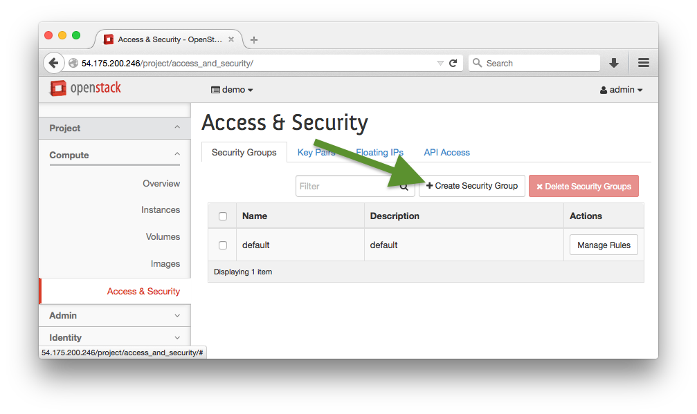
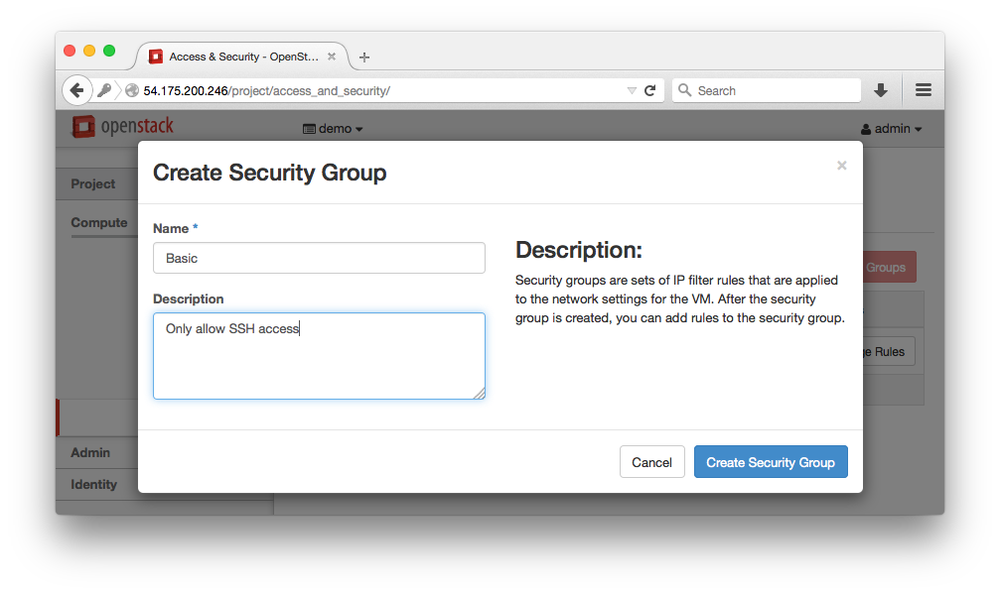
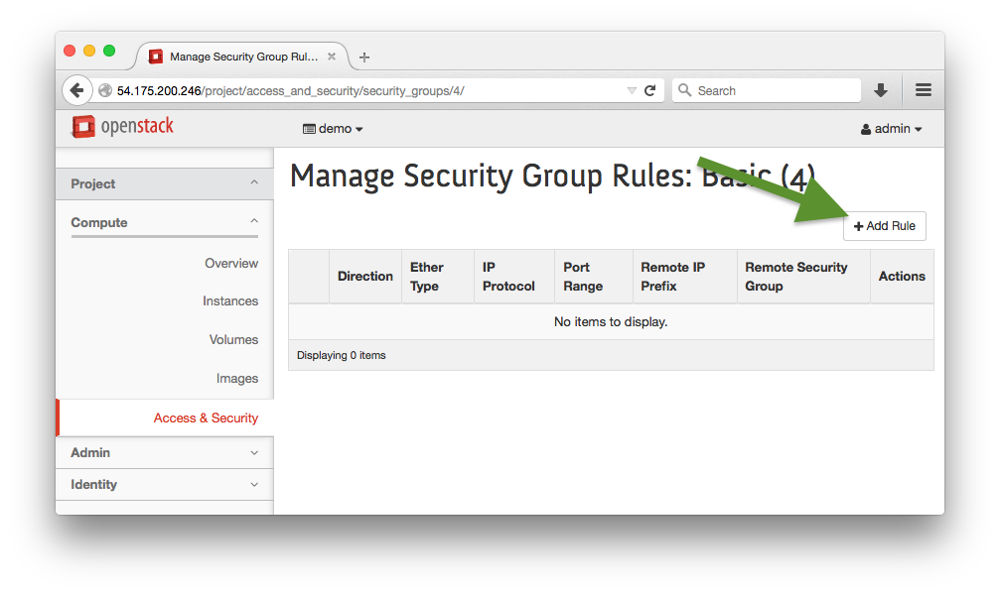
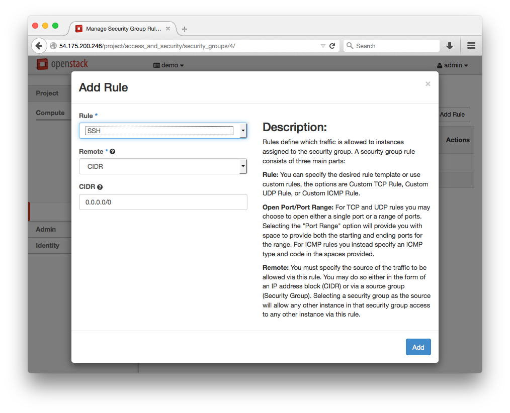
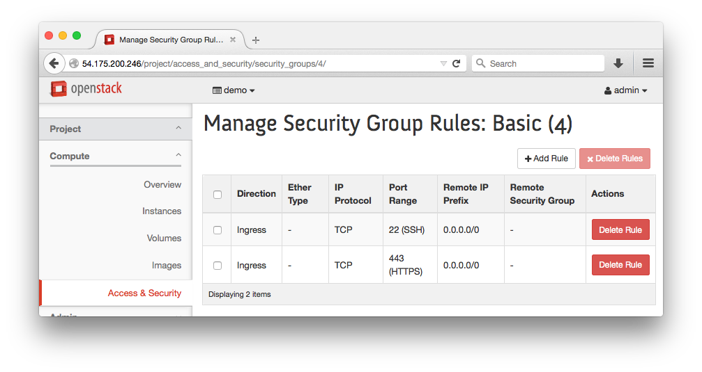
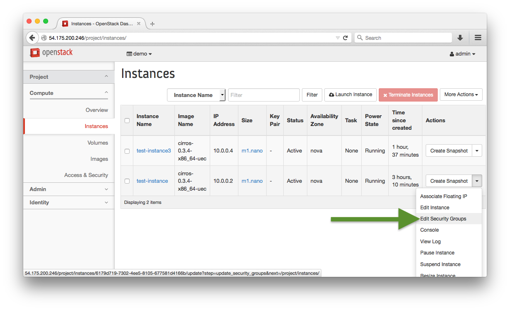
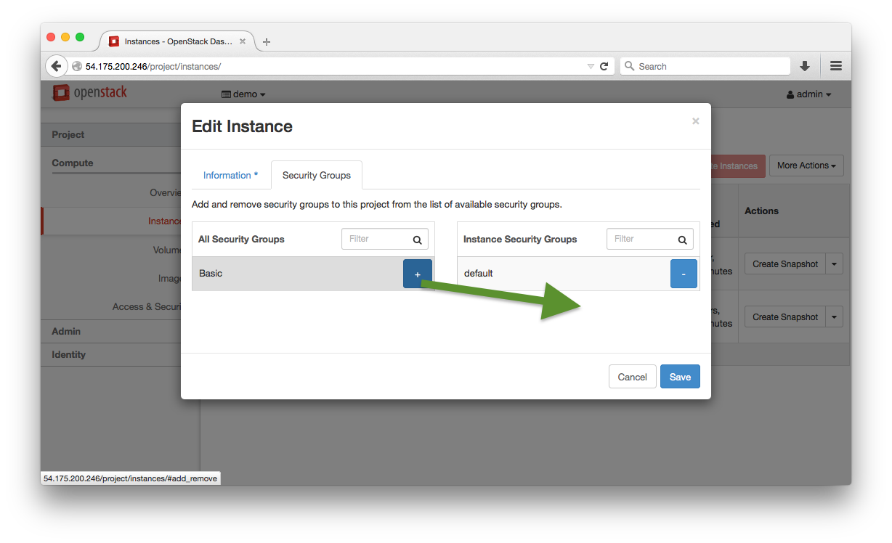

# Lab 4 - DevStack Security Groups & Floating IP 

  Lab Objectives:

  0. Become familiar with adding a Floating IP Address
  0. Become familiar with adding Security Groups

## Create and apply a Floating IP address

  0. Navigate to: Project > Compute > Instances
  0. Add a floating IP address to a running instance

     
     

  0. Test that this 

## Create and apply a Security Group

  0. Login to the OpenStack Horizon Web Interface by navigating your browser to the public IP address of the controller
  0. :red_circle: TODO login as user?
  0. Navigate to: Project > Compute > Access > Create Security Group

     
     

  0. Manage the new group and add an SSH rule
  
      
      
      

  0. Create another rule for HTTPS, the resulting Security Group should look like this

     
  
  0. Add the security group to a running instance
  

     
     

     Click the `+` on the Basic line and then Save

