# Lab 5 - DevStack CLI

  Lab Objectives:

  0. Become familiar with the openstack command line utilities

## Connect to controller CLI:

  0. Connect (ssh) into the controller
  0. `cd ~/devstack`
  0. `source openrc admin`
  0. `openstack` (starts openstack promt)

## List all the things!

  0. `endpoint list` - service endpoints and their ID's
  
     :red_circle: TODO: DevStack Broken? get screen shot 
      

  0. `hypervisor list` - compute hypervisors

     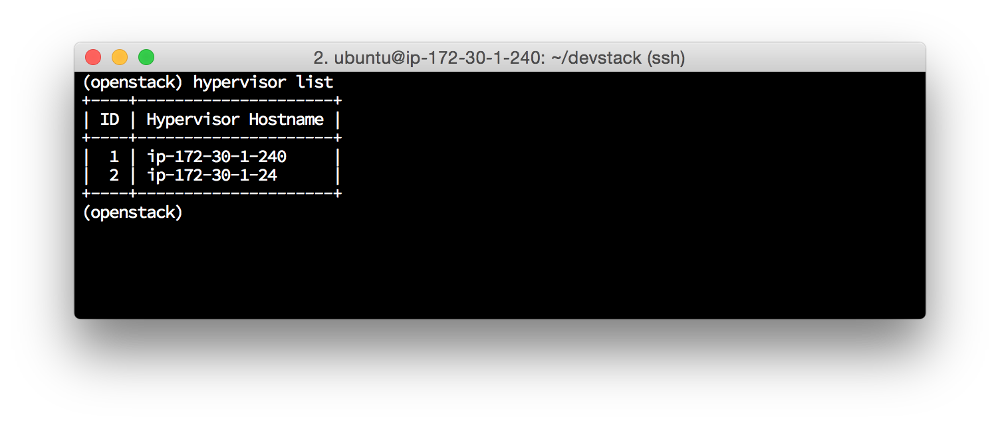 

  0. `host list` - openstack services and the host they are running on

     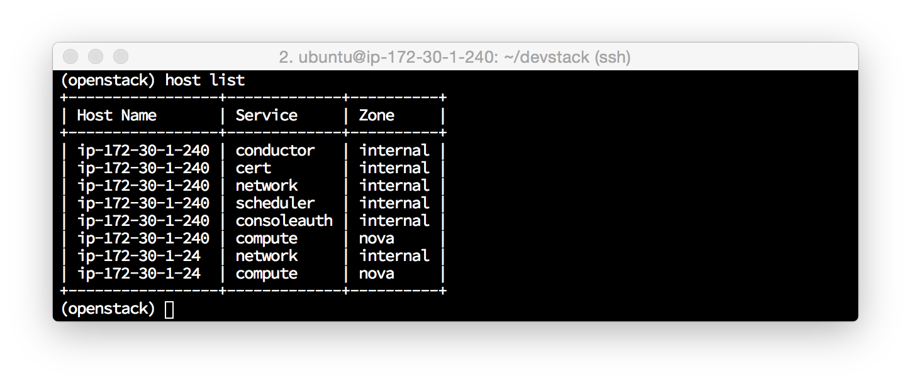 

  0. `image list` - glance OS images (from basic stack.sh install)

     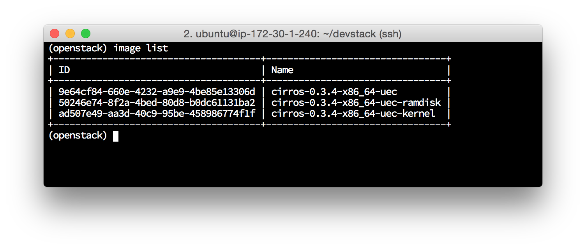 

  0. `flavor list` - instance flavors (resources)

     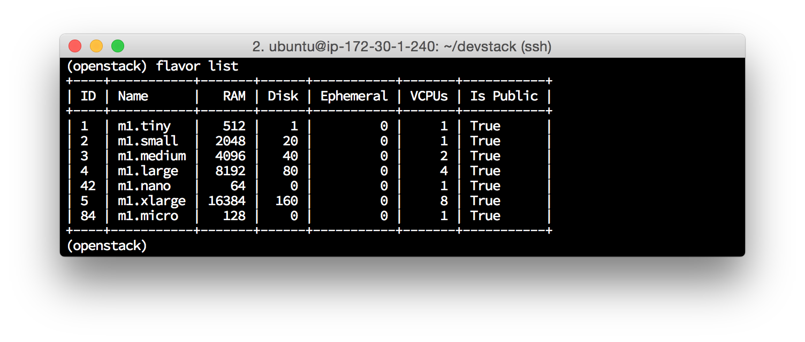 

  0. `user list` - user IDs

     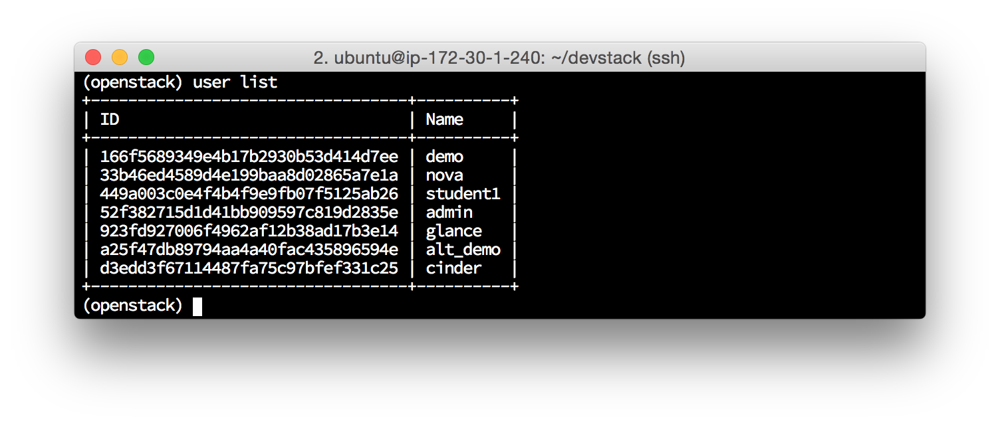 

  0. `project list` - projects 

     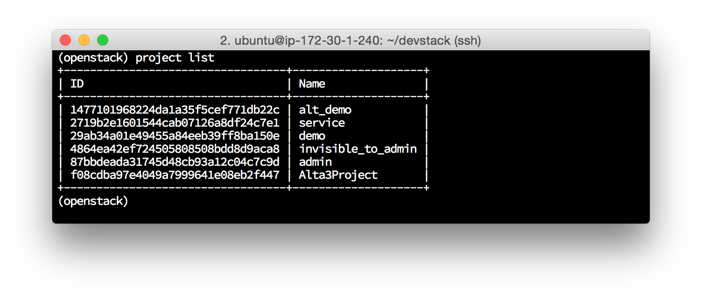 

  0. `catalog list` - API endponts

     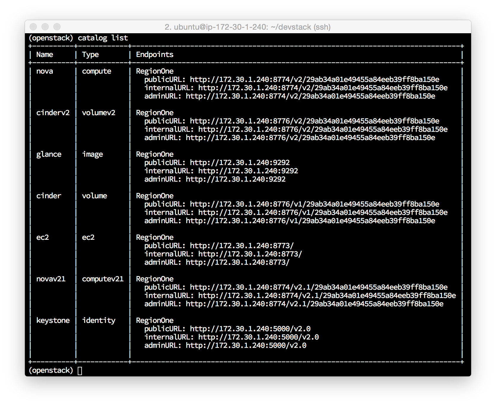 

  0. `help` - all commands

## Create a Project and User:

  0. `project create Alta3Project`

     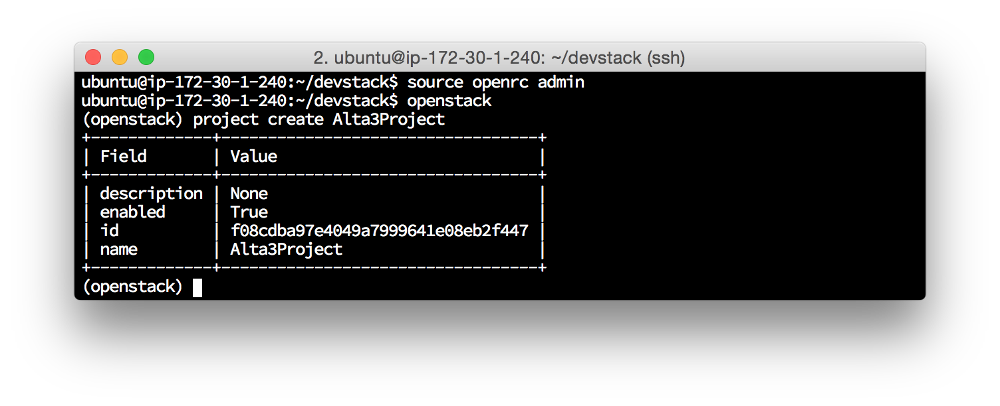

  0. `user create --email ubuntu@localhost --project Alta3Project --password supersecret student1`

     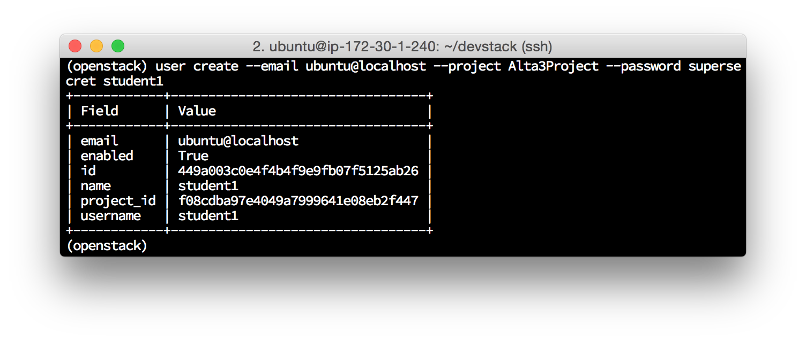

  0. `exit`

## Boot an Instance and assign a Floating IP:

  0. `nova boot --flavor m1.tiny --image cirros-0.3.4-x86_64-uec cliboot`

     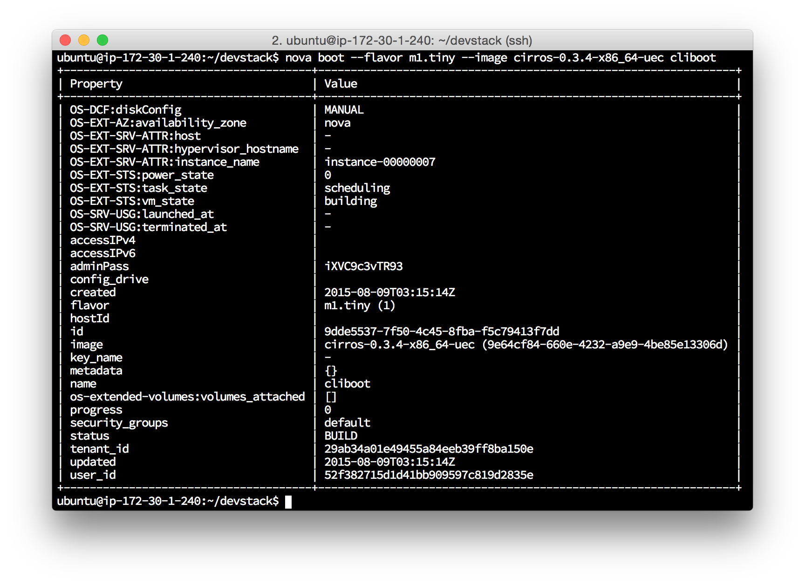

  0. `nova list`
     :red_circle: TODO: this image should be updated to reflect the 3 instances that would now be running, not 2 

     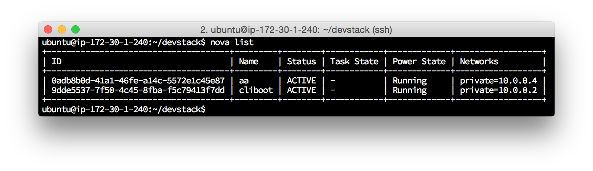

  0. `nova floating-ip-create`
  0. `nova floating-ip-associate cliboot x.x.x.x cliboot` (replace x.x.x.x with the floating IP created in the above step)

     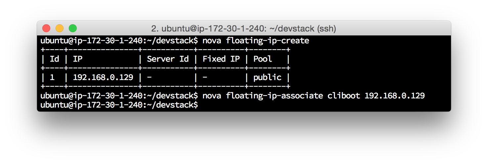
     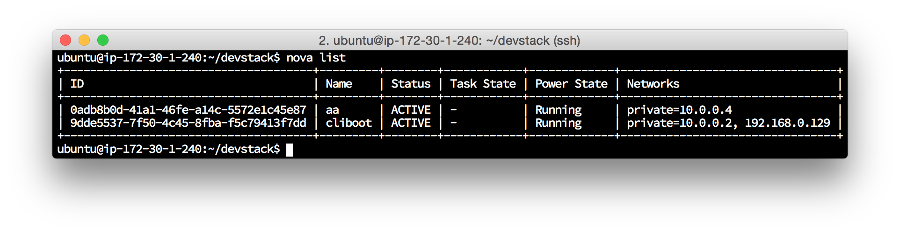

#### [Next Lab](../lab-06)    

