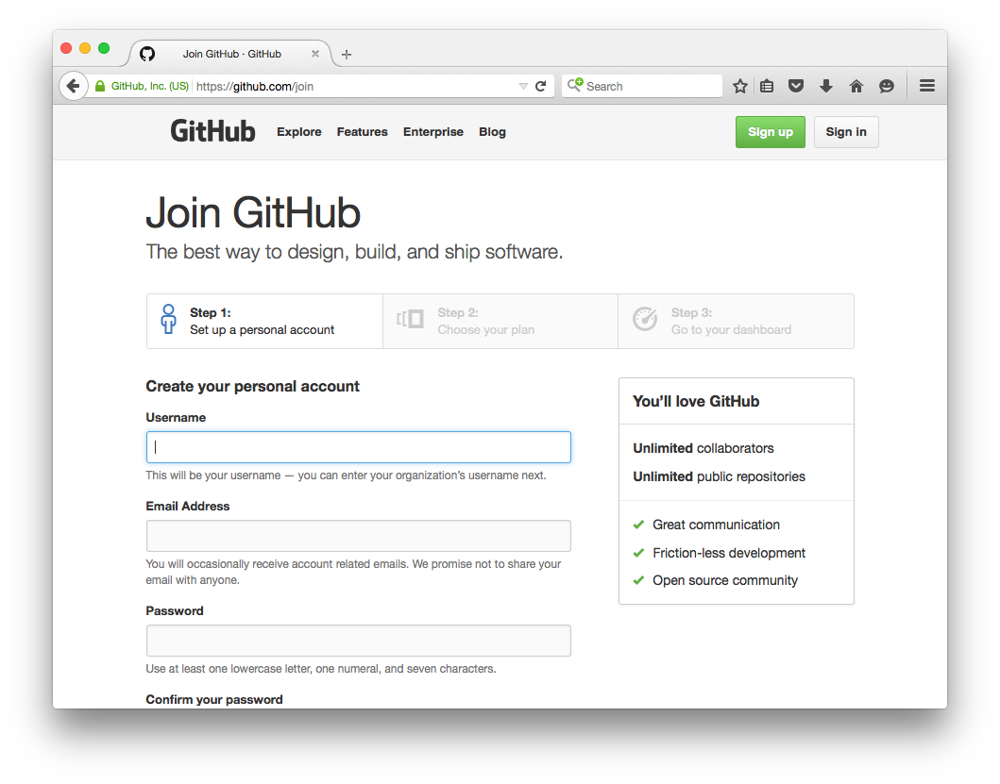
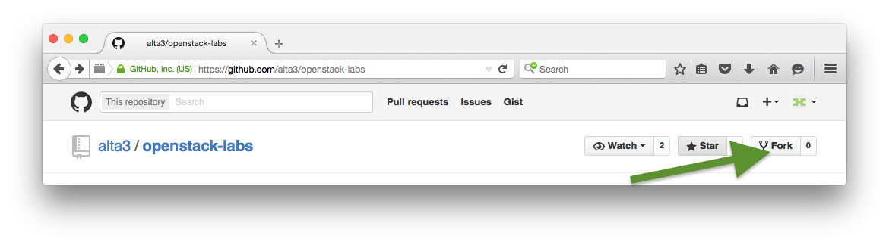
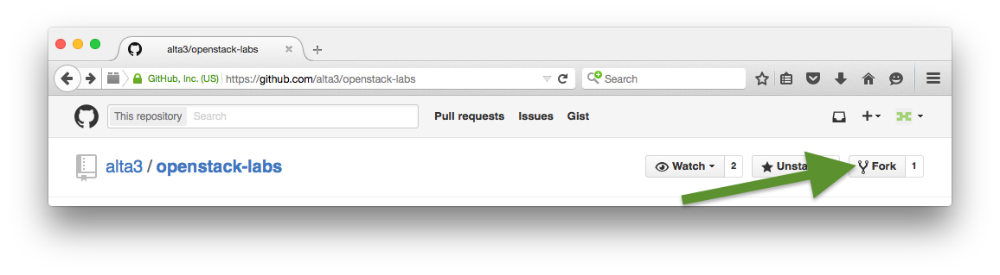
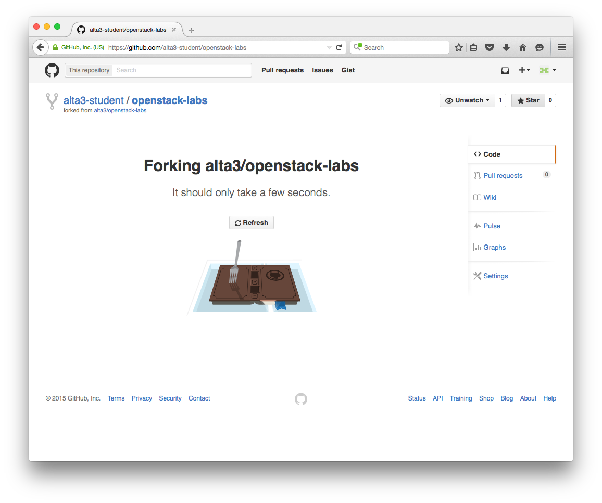
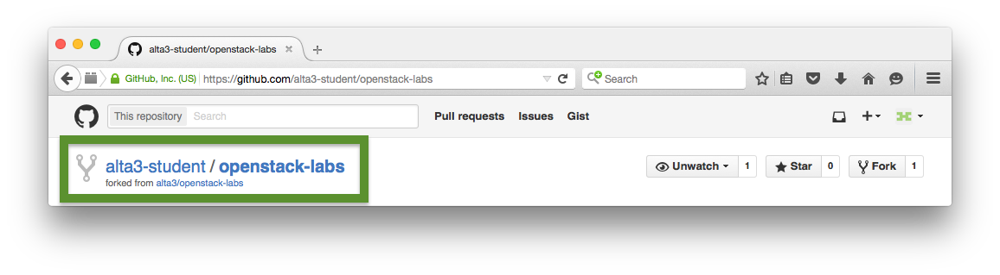

# Lab 0 - Lab Environment Setup

  Lab Objectives:

  0. Setup your own git fork of these labs
  0. Document Public IP and EC2 Internal IP addresses of lab instances
  0. Checkout (clone) this repository into your Jumper instance


## Setup Github Lab Repository

  0. In a new tab, [Create a Github account](https://github.com/join) or [Login](https://github.com/login)

    
      
  0. Return to this tab, refresh, you are now logged in.

  0. Star and this lab's repository

    If you aren't already here it is located at https://github.com/alta3/openstack-labs
    
    

    > :white_check_mark: **Additional Info**:
    >
    > Staring is like a bookmark on github.com,  you can view and search your stared repositories at [github.com/stars](github.com/stars)

  0. Fork the lab repository into your account

    

    

    

    From this point on you can edit and commit changes to your own copy 
    of the lab repository.  You can do this from right inside of github 
    (click edit on any file)

## Lab environment 

  This lab will utilize three hosts.  Below is a brief description of each host and 
  what it will be used for 

  **Jumper**: 
  
  A jumper is a simple linux machine you will use as a launching point into the lab environment.  
  We will ssh into this host in order to connect to all other instances in the lab environments.

  **Controller**:
   
  :red_circle: TODO explain Controller

  **Compute**: 

  :red_circle: TODO explain Compute

## Connect to Lab Instances


  **Lab Instance Detials**

| Attribute          | Jumper   | Controller | Compute   |
| ------------------ | -------- | ---------- | --------- |
| Size               | t2.micro | t2.medium  | t2.medium |
| OS image           | CentOS 7 | CentOS 7   | CentOS 7  |
| Public IP address  | x.x.x.x  | x.x.x.x    | x.x.x.x   |
| Private IP address | x.x.x.x  | x.x.x.x    | x.x.x.x   |

  0. Your instructor will provide you three public IP addresses.  
    Edit this README.md file and add the public IP addresses for the appropriate hosts.
  
    :red_circle: TODO Pictures of editing a github file

  0. Record your instance's internal IP address in the table
    
     * `ssh centos@<Public IP Address> -i student.pem`
       
        If using PuTTy, login as 'centos' and use the student.ppk keyfile (takes place of a password)

     * `ip addr show dev eth0`
       
        Record the displayed IPv4 address, not the IPv6 address. In the following example, your IPv4 address would occupy the location of x.x.x.x
        
        ```
        $ ip addr show dev eth0
        
    2: eth0: <BROADCAST,MULTICAST,UP,LOWER_UP> mtu 9001 qdisc pfifo_fast state UP qlen 1000
        link/ether 0a:6f:52:8c:f0:ef brd ff:ff:ff:ff:ff:ff
        inet x.x.x.x/24 brd 192.168.0.255 scope global dynamic eth0
          valid_lft 2829sec preferred_lft 2829sec
        inet6 fe80::86f:52ff:fe8c:f0ef/64 scope link
          valid_lft forever preferred_lft forever
        ```


  0. Set the hostname on each to help with command line differentiation

    * `sudo yum install -y vim nano`
    
        These hosts are super bare-bones. This command installs nano, a common (user friendly) CLI text editor. You can use vi or vim, however, all lab instructions will be given assuming the use of nano.
        
    * `sudo hostname jumper`
    
        This command sents the name of the 'jumper' machine to 'jumper'. Please use 'jumper' and not an inventive naming scheme. This helps making the troubleshooting process manageable.
        
    * `sudo nano /etc/hostname`
  
      the content of the file should be the single, lowercase, name of the instance    

    * `exit`
    
        The terminal session will exit. After it does, log right back in...
    
    * `ssh centos@<Public IP Address> -i student.pem`
    
        bash should look like this now: `[centos@jumper ~]`

  0. Prevent hostname updates on reboot

    * `sudo nano /etc/cloud/cloud.cfg`

    Comment out these two entries uner `cloud_init_modules`:

    ```
    - set_hostname
    - update_hostname
    ```
    
    * `sudo reboot`

## Checkout your forked repository

  0. `ssh centos@<Jumper Public IP> -i student.pem`
  0. `sudo yum install -y git`
  0. `git clone https://github.com/<Your username>/openstack-labs`
  0. :red_circle: TODO fill this out with instructions and screen shots
    * make a change to a file
    * commit the change
    * push the change into github so it can be viewed on the webpage


#### [Continue to the next lab](../lab-01)
