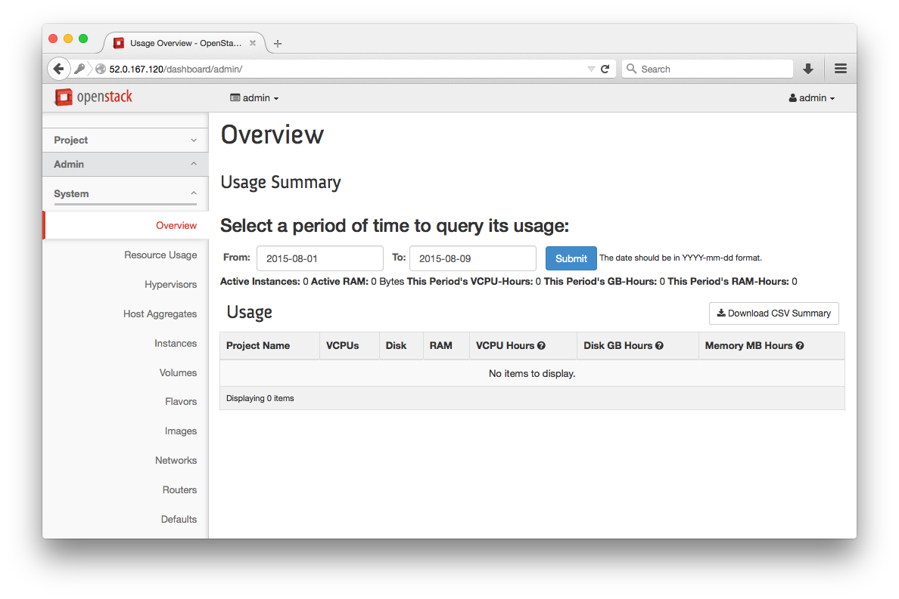

# Lab 2 - Horizon Interface

  Lab Objectives:

  0. Become familiar with the OpenStack Horizon Interface

## Login to the Horizon Interface

  0. Login to the OpenStack Horizon Web Interface by navigating your browser to the public IP address of your instance, explore the accessible pages and fill in the table of information

    
    
    

  0. Navigate around the interface, find and document the below values

    | Info to find                       | Value | 
    | ---------------------------------- | ----- |
    | Available VCPUs                    |       |
    | Available Memory                   |       |
    | Available Disk                     |       |
    | Total Glance Images                |       |
    | Total Glance Disk Size             |       |
    | Total number of Flavors            |       |             
    | Total number of OpenStack Services |       |
    | Total number of Network Agents     |       |
    | Total number of Users              |       |
    | Total number of Project            |       |
    | Demo Private Subnet Address Range  |       |
    | Demo Router IP address             |       |
    | Demo DHCP IP address               |       |

#### [Continue to the next lab](../lab-03)
