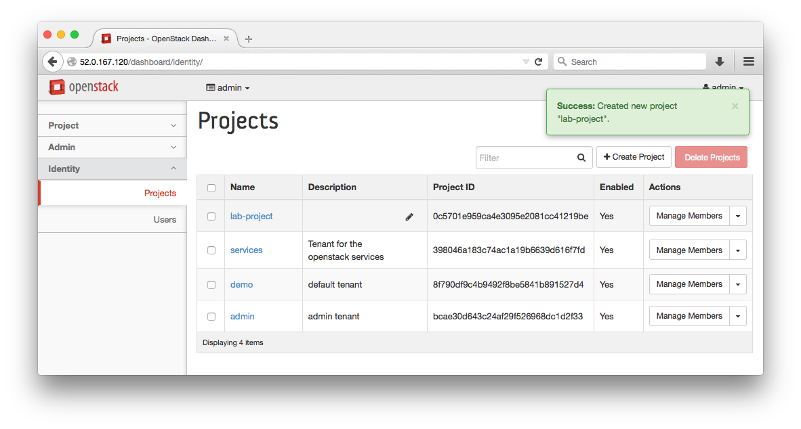
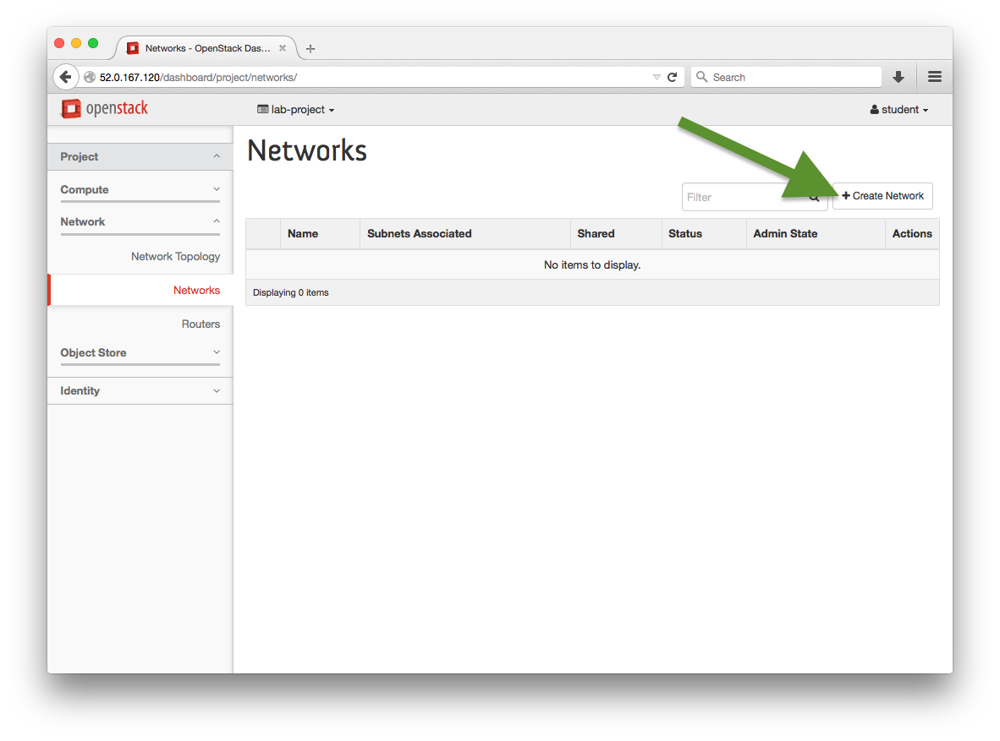
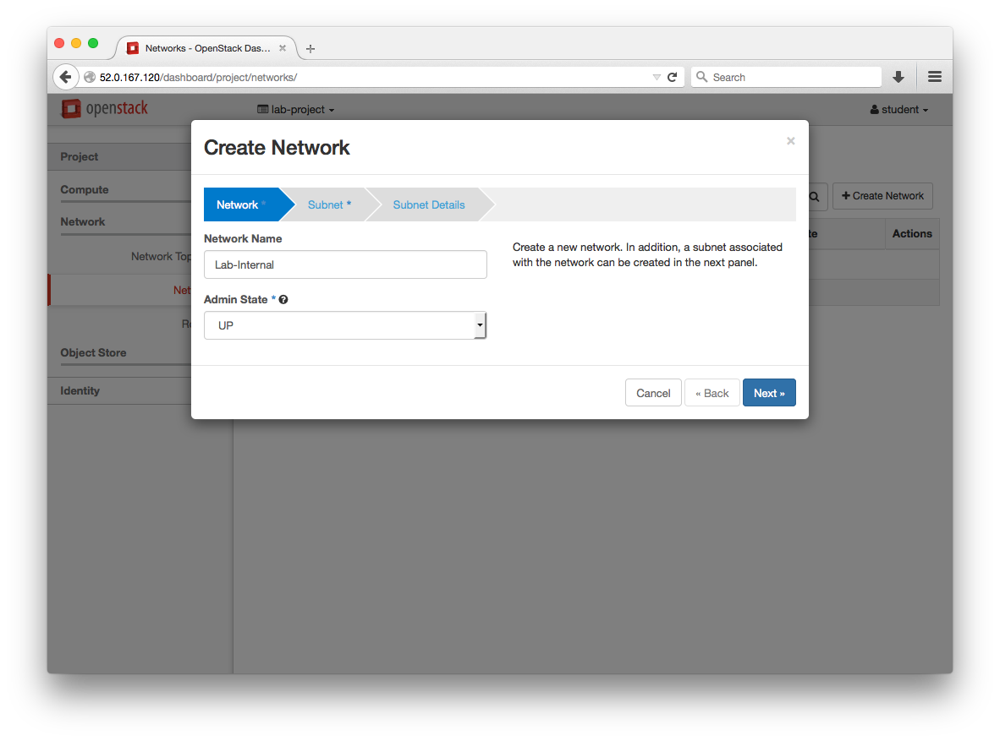
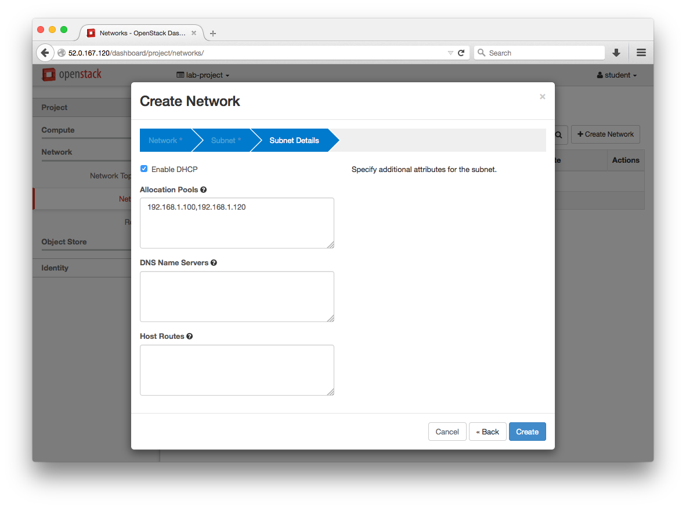

# Lab 2 - RDO Horizon Interface

  Lab Objectives:

  0. Become familiar with the OpenStack Horizon Interface

## Login to the Horizon Interface

  0. Login to the OpenStack Horizon Web Interface by navigating your browser to the public IP address of your instance, explore the accessible pages and fill in the table of information

    
    
    

  0. Navigate around the interface, find and document the below values
    :red_circle: TODO find these items from interface

    | Info to find | Value |
    | -------------| ----- |
    | Item 1 | |
    | Item 2 | |
    

## Add a Project:

  0. Navigate to: Identity > Project > +Create Project
     
     
     
     

## Add a User:

  0. Navigate to: Identity > Users > +Create User

     
     
     

## Member Interface

  0. Logout from the `admin` account and login as `student`
  0. Explore :red_circle: TODO: table of things to find/document

## Add a Private Network

  0. Navigate to: Project > Network > Networks > +Create Network

     
     
     
     

     > :white_check_mark: **Additional Info**:
     >
     > The Allocation Pools is the `start,end` addresses for the pools.
     > The entry form for this field does not parse spaces.
     > Example Pool: `192.168.1.100,192.168.1.120`

     

## Add a Router

  0. Navigate to: Project > Network > Network Topology > +Create Router
     
     
     
  
  0. Either click on "View Router Details" or choose our new router from the list on Project > Network > Routers

     
     

  0. Add an interface to the new router

     
     
     

  0. Set the Gateway for this network

     
     

  0. View the Network Topology and Networks page and verify configurations

     
     

#### [Next Lab](../lab-03)    
