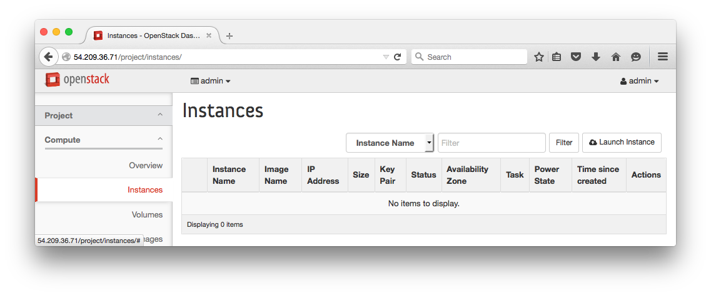
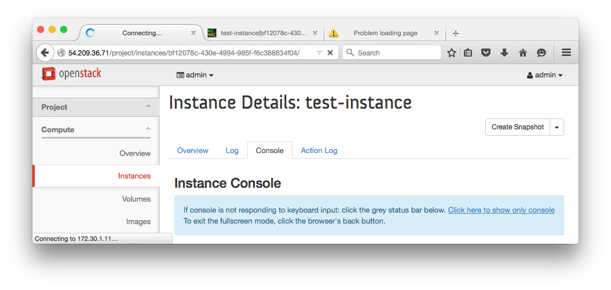
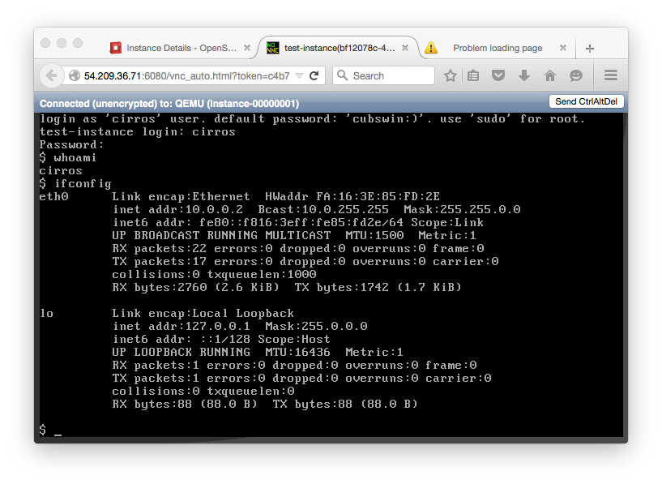

# Lab 2

## Launch an Instance on DevStack

  0. Project > Compute > Instances > Launch Instance
  
    

  0. Set details and launch

    
    
  
  0. Open console
    
    
    
    

    > :red_circle: **DevStack Issue**:
    >
    > The VNC link provided uses the internal IP address of the controller.  You will need to modify this to be the public IP address.

