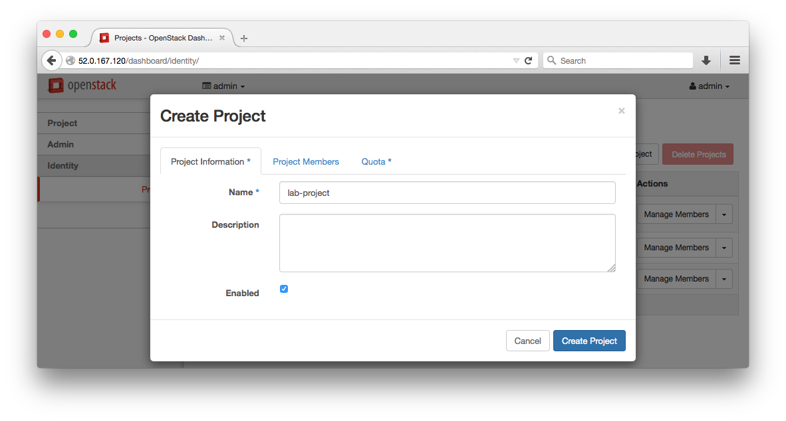
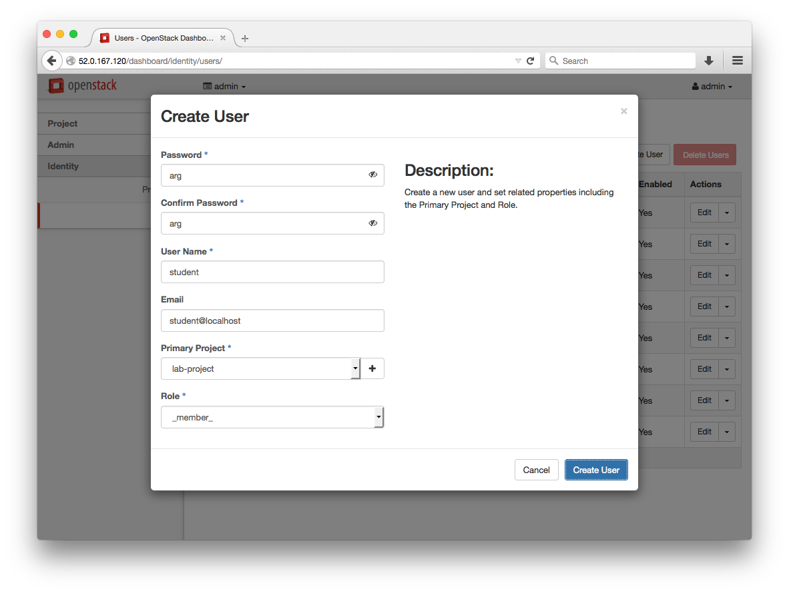
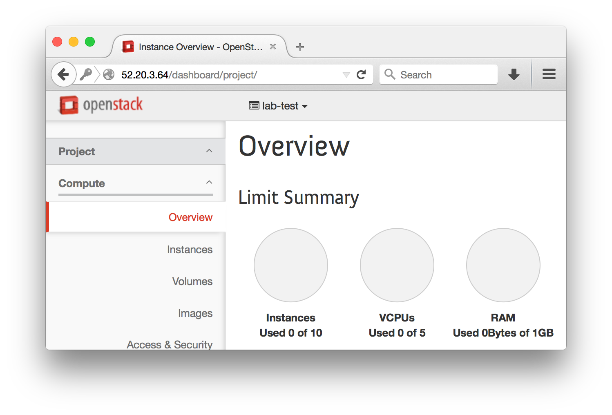

# Lab 3 - Projects and Users 

  Lab Objectives:

  0. Demonstrate the ability to create Projects and Users from the Horizon Web Interface

## Add a Project:

  0. Navigate to: Identity > Project > +Create Project
     
     
     
     

## Add a User:

  0. Navigate to: Identity > Users > +Create User

     
     
     

## Member Interface

  0. Logout from the `admin` account and login as `student`
  0. Explore :red_circle: TODO: table of things to find/document

## Extra Credit 

  0. Set the student's project quota to a realistic level, givin the of the available VCP and Memory on our system
  0. View change from the student login on the Overview page
    
