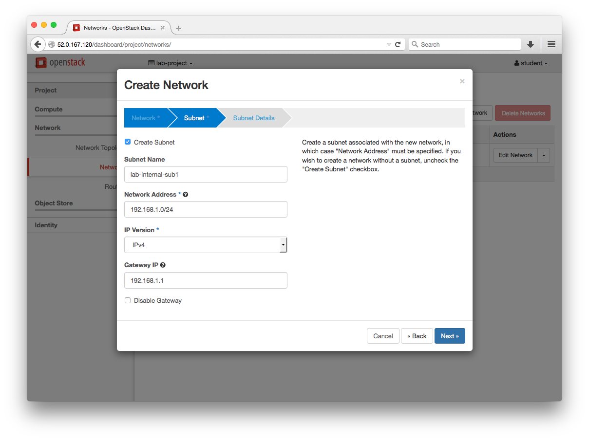
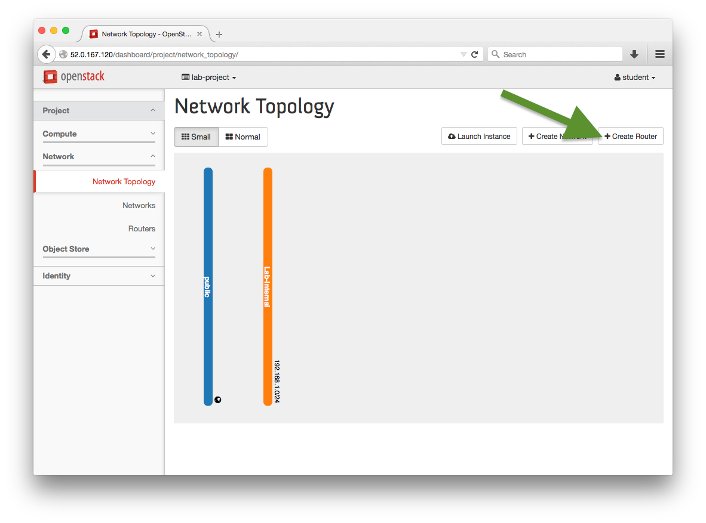
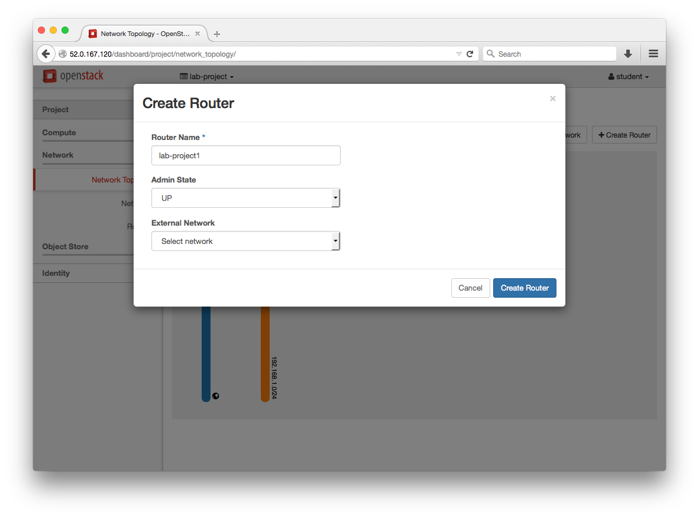
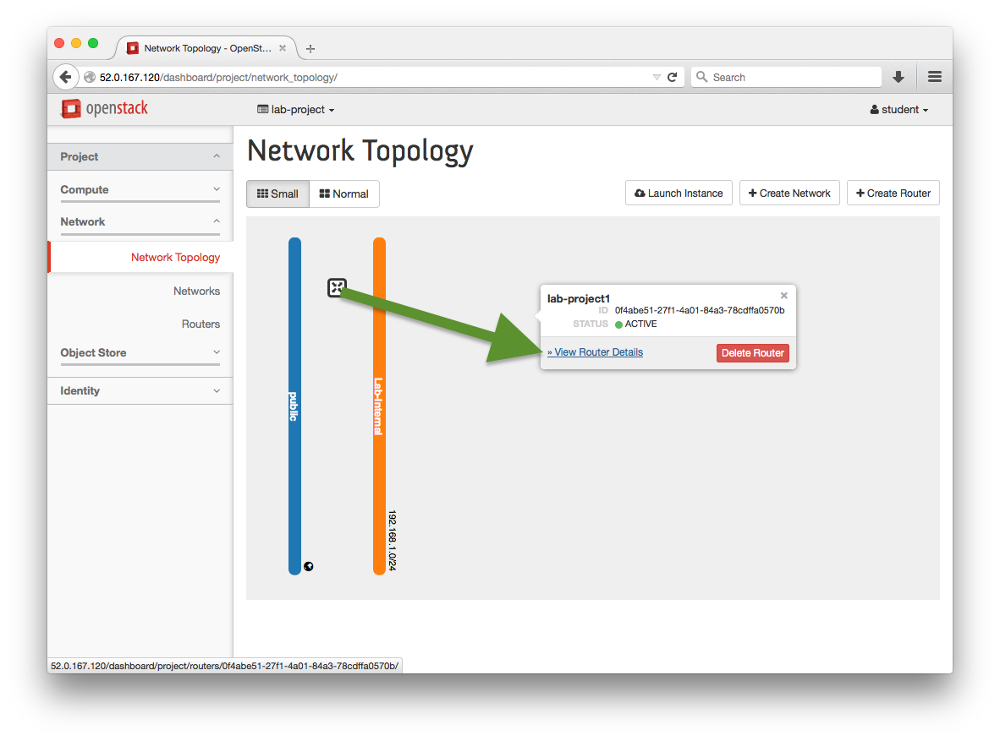
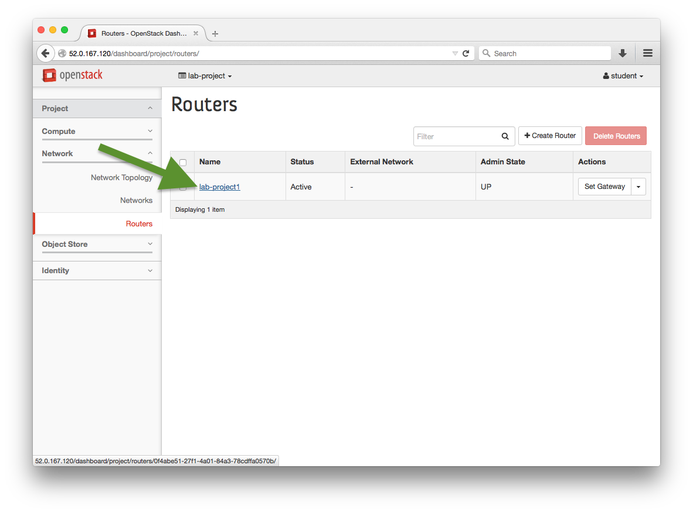
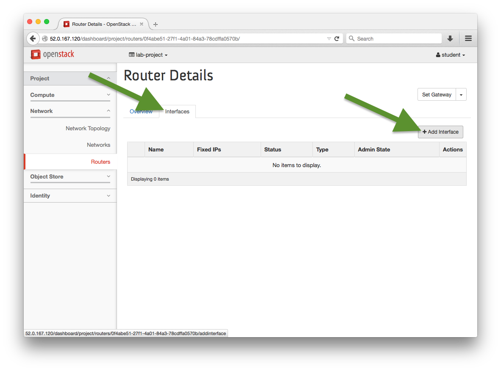
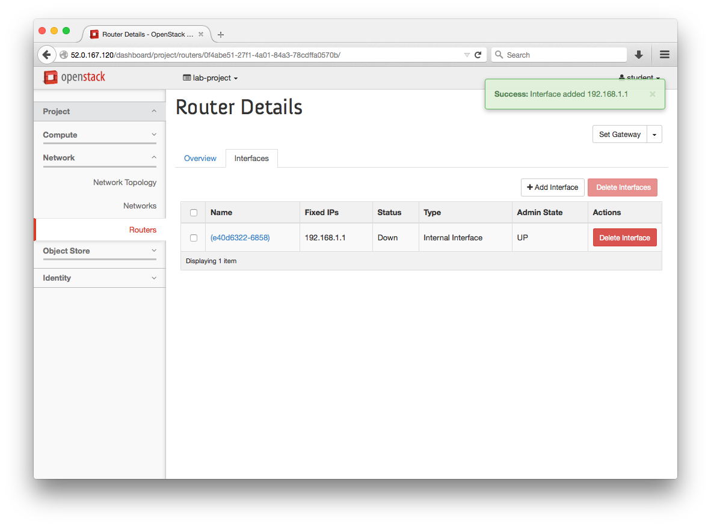
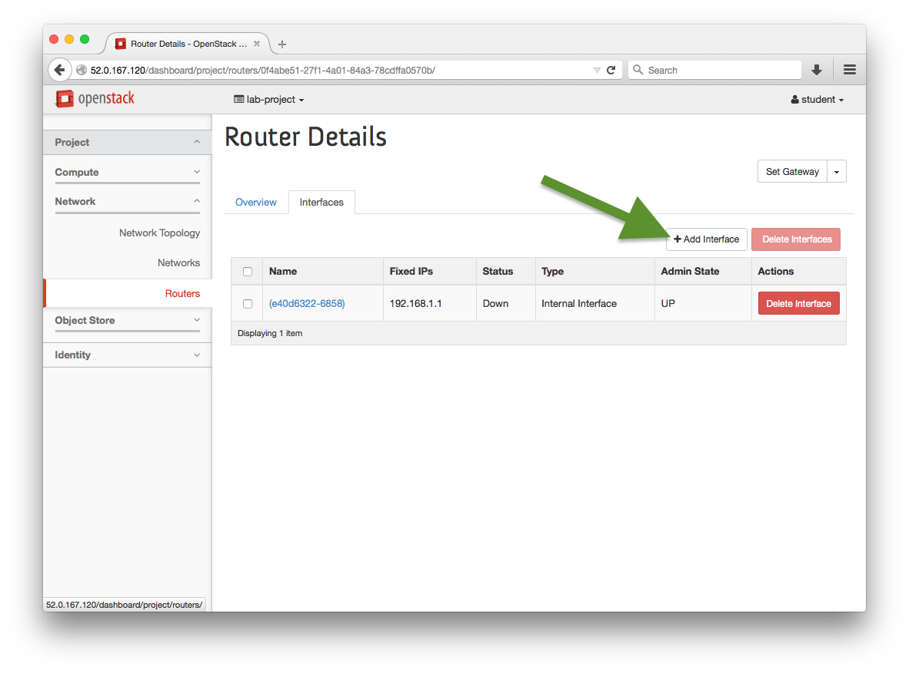
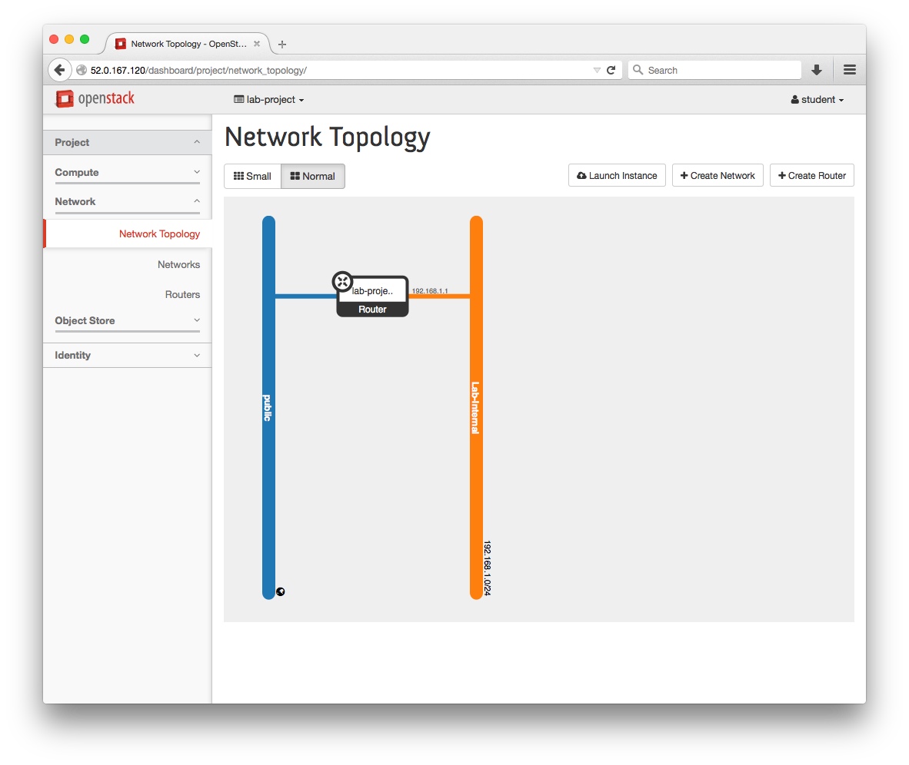

## Add a Private Network

  0. Navigate to: Project > Network > Networks > +Create Network

     
     
     
     

     > :white_check_mark: **Additional Info**:
     >
     > The Allocation Pools is the `start,end` addresses for the pools.
     > The entry form for this field does not parse spaces.
     > Example Pool: `192.168.1.100,192.168.1.120`

     

## Add a Router

  0. Navigate to: Project > Network > Network Topology > +Create Router
     
     
     
  
  0. Either click on "View Router Details" or choose our new router from the list on Project > Network > Routers

     
     

  0. Add an interface to the new router

     
     
     

  0. Set the Gateway for this network

     
     

  0. View the Network Topology and Networks page and verify configurations

     
     

